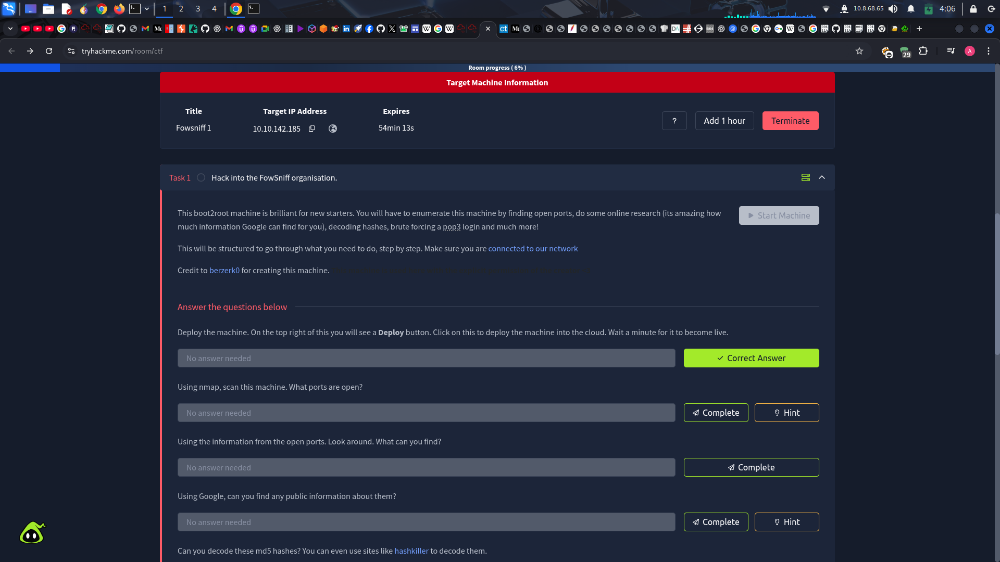
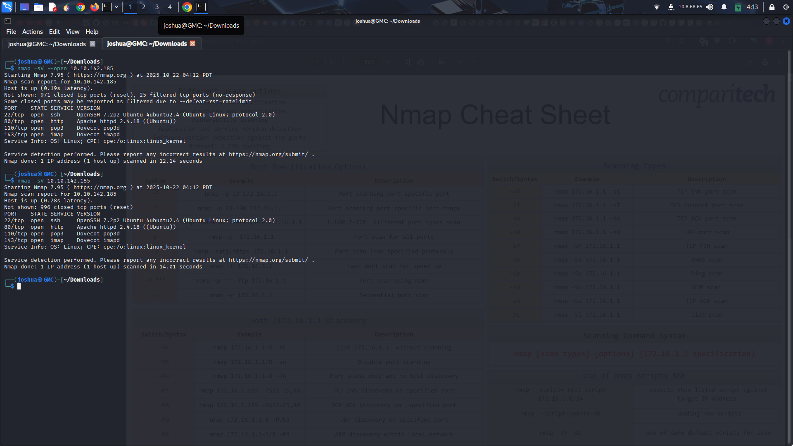

# FowSniff-A-tryhackme-challenge-
A practice showcasing my skills in network enumeration, service fingerprinting and exploiting weak authentication.

# Initial Setup & Connectivity

I started a virtual machine configured to route traffic through my Kali Linux attacker environment and ensured the lab VPN connection was active.

I verified basic connectivity to the TryHackMe network by pinging the target IP; the host responded, confirming network reachability and that the VPN tunnel was functioning correctly for further enumeration.
# Challenge Summary

Fowsniff is a TryHackMe room that demonstrates a common, realistic attack chain which includes, information disclosure via a publicly exposed artifact → credential recovery → authenticated access → local misconfiguration → privilege escalation → full compromise.

## High-level attack flow observed in this challenge

1. Public web artifact discovered that contained sensitive files.
2. Credentials recovered from that artifact and validated against exposed services.
3. Authenticated access obtained as a normal user.
4. Local enumeration revealed misconfigurations and privileged utilities.
5. A controlled privilege escalation chain was executed to obtain root.
6. Proofs of compromise (user and root flags) were collected and archived.

## First Step — Connecting the Attacker Terminal to TryHackMe (VPN)

### Objective
Place my attacker environment on the TryHackMe lab network so the target machine is reachable and all subsequent steps are performed within the authorized lab environment.

### What I did:

I launched my attacker virtual machine and ensured it had an up-to-date network stack and the VPN client available.

I started the OpenVPN client using the TryHackMe provided .ovpn profile that authenticates and places my VM onto TryHackMe’s lab network. The client completed a successful TLS handshake with the TryHackMe VPN server and established a virtual TUN interface.

Once the tunnel came up, the client received an internal VPN address from the lab and the server pushed the lab routing information to my machine. The VPN reported the assignment of the lab subnet address and the pushed routes for TryHackMe lab networks. 
https://github.com/LuckyboyJay/FowSniff-A-tryhackme-challenge-/blob/main/first%20i.p%20.png

I validated basic reachability by using the simplest network check, specifically, I sent ICMP probes to the target IP and observed responses confirming the VPN tunnel was operational and the target was reachable from my attacker VM.

### Evidence / expected signs of success (what I observed)

- The VPN client showed a successful TLS connection and certificate verification with the lab server.
- The TUN interface was created and reported an IP address in the TryHackMe lab range.
- The VPN server pushed routing entries for the lab networks, which were accepted by the client.
- ICMP checks to the target host returned responses, demonstrating end-to-end connectivity through the VPN.

### Why this step matters

Establishing the VPN tunnel is the gating action that guarantees all subsequent reconnaissance and exploitation occur only inside the sanctioned TryHackMe environment. It ensures the attacker VM and the target machine are on the same logical network and that testing stays within authorized bounds.

### Notes & Troubleshooting Observations (non-exhaustive)

A successful VPN session requires both a valid lab profile and a functioning network path from the host to the lab VPN server; certificate verification and route push must complete for the environment to be usable.

If the TUN interface is present but the target is unreachable, common causes include missing routes from the server, route installation races on the client, or local firewall rules blocking tunnel traffic — these are the things I would inspect if connectivity had failed.

I recorded the VPN connection session output and a quick network reachability snapshot as part of the evidence package for reproducibility and later analysis.

# Step 2

Answering the questions accoringly from the challenge. I scanned the target from my attacking machine using Nmap to discover open services and versions.
nmap -sV --open
this is ran to quickly identify which services are running (FTP, POP3, SSH, HTTP, etc.) and their versions so I know where to focus enumeration and exploitation efforts.\
Then i looked for open ports and corresponding services.
Service versions that hint at vulnerabilities or known misconfigurations.
Unusual or unexpected services that could indicate additional attack paths.
Any banners or extra information (FTP welcome messages, HTTP titles) that might contain usernames, paths, or clues.

